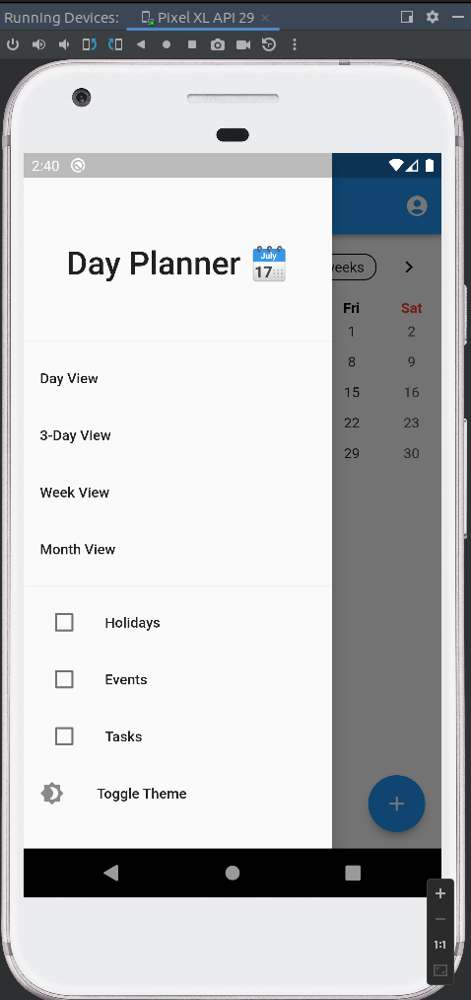

# Your App Name


A Flutter application for managing your daily schedule and events.

## Features

- **Calendar View:** View your schedule by day, week, or month.
- **Event Management:** Add, edit, and delete events for your schedule.
- **Theme Toggle:** Switch between light and dark themes for comfortable usage.

## Screenshots




## Getting Started

Follow these instructions to get a copy of the project up and running on your local machine for development and testing purposes.

### Prerequisites

- [Flutter](https://flutter.dev/) installed on your system.

### Installation

1. Clone the repository:

   ```bash
   git clone https://github.com/yourusername/your-app.git
